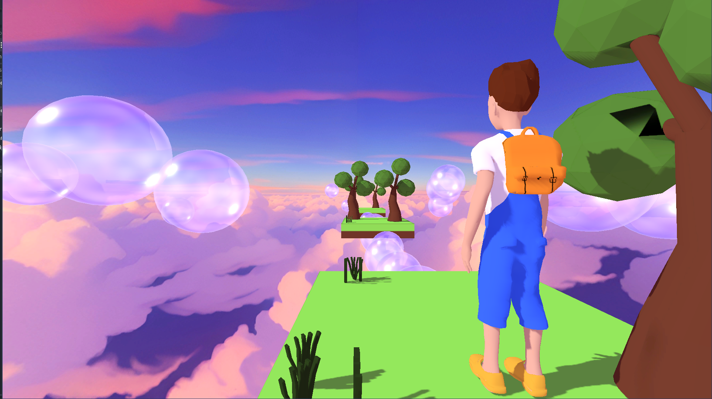
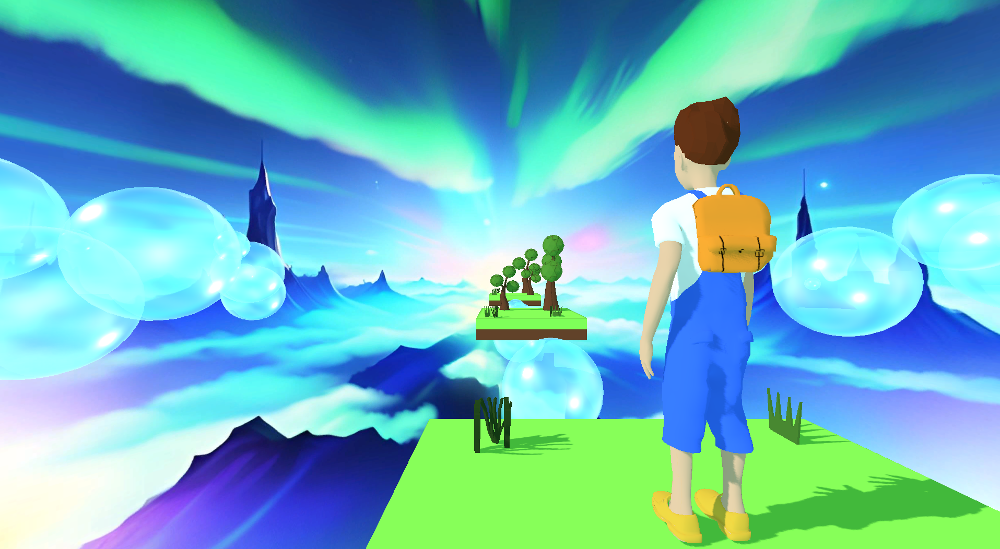

# jumpb
A game for GNU/Linux using Godot Game Engine 4
# Level 1

# Level 2


For importing to Godot 4 you need to do:
```
git clone https://github.com/oscarpavon/jumpb
```
And then just import to Godot with the user interface
